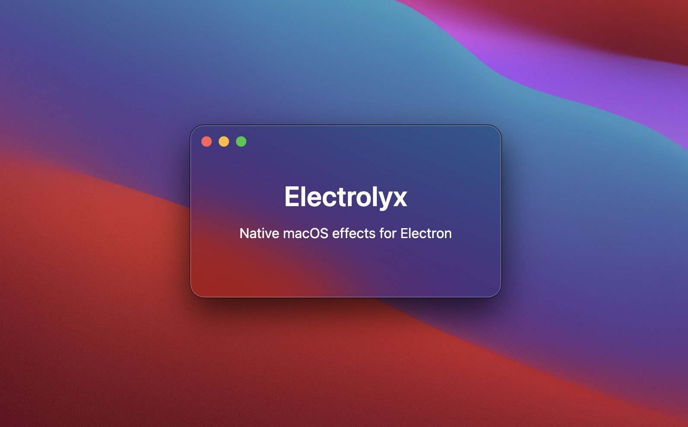

<p align="center">
  
</p>

# Electrolyx

**Kit de herramientas para Electron con licencia MIT para efectos visuales nativos de macOS**

Electrolyx incorpora personalización nativa de ventanas de macOS y efectos visuales a aplicaciones de Electron, incluidas esquinas redondeadas y efectos de vidrio/vibrancia.

## Características

- **Esquinas personalizadas de ventanas**: Aplica esquinas redondeadas con estilo nativo a ventanas de Electron
- **Efectos de vibrancia/vidrio**: Crea elementos de interfaz translúcidos con desenfoque usando `NSVisualEffectView` nativo
- **Transparencia de ventanas**: Control total sobre la transparencia del fondo de la ventana
- **Soporte para TypeScript**: Definiciones de tipos completas incluidas
- **Licencia MIT**: Totalmente gratuito para cualquier proyecto

## Instalación

```bash
npm install electrolyx
```

### Requisitos

- macOS 10.13 (High Sierra) o posterior
- Electron 20.0.0 o posterior
- Node.js 16.0.0 o posterior
- Herramientas de línea de comandos de Xcode (para compilar el módulo nativo)

## Inicio rápido

```typescript
import { app, BrowserWindow } from 'electron';
import { setWindowCornerRadius, addVibrancyView, setWindowTransparent } from 'electrolyx';

function createWindow() {
  const window = new BrowserWindow({
    width: 800,
    height: 600,
    transparent: true,
    titleBarStyle: 'hiddenInset'
  });

  window.once('ready-to-show', () => {
    // Establecer esquinas redondeadas personalizadas
    setWindowCornerRadius(window, 16);

    // Hacer el fondo transparente
    setWindowTransparent(window);

    // Agregar barra lateral con efecto de vibrancia
    addVibrancyView(window, {
      x: 0,
      y: 0,
      width: 250,
      material: 'sidebar',
      cornerRadius: 16
    });

    window.show();
  });
}

app.whenReady().then(createWindow);
```

## Documentación de la API

### `setWindowCornerRadius(window, radius)`

Establece el radio de esquina personalizado para una ventana.

**Parámetros:**
- `window` (BrowserWindow) - Instancia de BrowserWindow de Electron
- `radius` (number) - Radio de esquina en puntos

**Devuelve:** `boolean` - true si es exitoso

**Nota:** Esto utiliza APIs privadas de macOS y podría fallar en versiones futuras de macOS.

```typescript
setWindowCornerRadius(mainWindow, 16);
```

---

### `getWindowCornerRadius(window)`

Obtiene el radio de esquina actual de una ventana.

**Parámetros:**
- `window` (BrowserWindow) - Instancia de BrowserWindow de Electron

**Devuelve:** `number` - Radio de esquina actual en puntos

```typescript
const radius = getWindowCornerRadius(mainWindow);
```

---

### `addVibrancyView(window, options)`

Agrega una vista nativa de efecto de vibrancia (desenfoque/vidrio) a una ventana.

**Parámetros:**
- `window` (BrowserWindow) - Instancia de BrowserWindow de Electron
- `options` (VibrancyViewOptions) - Opciones de configuración

**VibrancyViewOptions:**

```typescript
interface VibrancyViewOptions {
  x?: number;                    // Predeterminado: 0
  y?: number;                    // Predeterminado: 0
  width?: number;                // Predeterminado: 200
  height?: number;               // Predeterminado: altura de la ventana
  material?: VibrancyMaterial;   // Predeterminado: 'sidebar'
  blendingMode?: BlendingMode;   // Predeterminado: 'behindWindow'
  state?: VibrancyState;         // Predeterminado: 'followsWindowActiveState'
  cornerRadius?: number;         // Predeterminado: 0
  autoresizingMask?: {
    width?: boolean;
    height?: boolean;
    minX?: boolean;
    maxX?: boolean;
    minY?: boolean;
    maxY?: boolean;
  };
}
```

**Tipos de material:**
- `'titlebar'` - Apariencia de barra de título
- `'sidebar'` - Apariencia de barra lateral (predeterminado)
- `'menu'` - Apariencia de menú
- `'popover'` - Apariencia de popover
- `'hudWindow'` - Apariencia de ventana HUD
- `'sheet'` - Apariencia de hoja (sheet)
- `'tooltip'` - Apariencia de información sobre herramientas
- `'underWindowBackground'` - Debajo del fondo de la ventana

**Ejemplo:**

```typescript
addVibrancyView(mainWindow, {
  x: 0,
  y: 0,
  width: 250,
  height: 700,
  material: 'sidebar',
  blendingMode: 'behindWindow',
  cornerRadius: 16,
  autoresizingMask: {
    height: true  // Redimensionar con la altura de la ventana
  }
});
```

---

### `setWindowBackgroundColor(window, color)`

Establece el color de fondo de una ventana.

**Parámetros:**
- `window` (BrowserWindow) - Instancia de BrowserWindow de Electron
- `color` (RGBColor) - Objeto de color con valores r, g, b (0-1)

```typescript
setWindowBackgroundColor(mainWindow, {
  r: 1.0,
  g: 1.0,
  b: 1.0,
  a: 0.95
});
```

---

### `setWindowTransparent(window)`

Hace que el fondo de una ventana sea completamente transparente.

**Parámetros:**
- `window` (BrowserWindow) - Instancia de BrowserWindow de Electron

```typescript
setWindowTransparent(mainWindow);
```

## Ejemplos

### Esquinas redondeadas + Fondo transparente

```typescript
const window = new BrowserWindow({
  width: 800,
  height: 600,
  transparent: true,
  frame: false
});

window.once('ready-to-show', () => {
  setWindowCornerRadius(window, 20);
  setWindowTransparent(window);
  window.show();
});
```

### Barra lateral con vibrancia

```typescript
addVibrancyView(mainWindow, {
  x: 0,
  y: 0,
  width: 250,
  material: 'sidebar',
  cornerRadius: 16,
  autoresizingMask: {
    height: true  // Redimensionamiento automático con la ventana
  }
});
```

### Ejemplo completo

Consulte el directorio `example/` para una aplicación Electron completa y funcional que demuestra todas las características.

Para ejecutar el ejemplo:

```bash
npm run build
cd example
npm install
npm start
```

## Advertencias importantes

### APIs privadas

La función `setWindowCornerRadius()` utiliza **APIs privadas de macOS** que:
- No están documentadas por Apple
- No están garantizadas para funcionar en todas las versiones de macOS
- Pueden cambiar o eliminarse en actualizaciones futuras
- Podrían ser rechazadas potencialmente en envíos a la Mac App Store

**Úselo bajo su propia responsabilidad** y siempre pruebe exhaustivamente en las versiones objetivo de macOS.

### Efectos de vibrancia (Seguros)

Las características de vibrancia utilizan **APIs públicas de `NSVisualEffectView`** que:
- Están oficialmente documentadas por Apple
- Son estables a través de las versiones de macOS
- Son seguras para envíos a la Mac App Store

## Compilación desde el código fuente

```bash
# Instalar dependencias
npm install

# Compilar módulo nativo y TypeScript
npm run build

# O compilar por separado
npm run build:native
npm run build:ts
```

## Solución de problemas

### Errores de compilación con rutas que contienen espacios

Si encuentra errores de compilación como `clang: error: no such file or directory` durante `npm install`, es probable que se deba a que node-gyp no maneja correctamente las rutas con espacios (por ejemplo, "Proyectos Personales", "Mis Documentos").

**Solución alternativa:**

1. Copie el proyecto a una ubicación temporal sin espacios:
   ```bash
   cp -R /path/with spaces/electrolyx ~/electrolyx-temp
   cd ~/electrolyx-temp
   rm -rf build node_modules
   npm install
   ```

2. Copie el módulo compilado de vuelta a su ubicación original:
   ```bash
   cp ~/electrolyx-temp/build/Release/electrolyx.node /path/with spaces/electrolyx/build/Release/
   cp -R ~/electrolyx-temp/node_modules /path/with spaces/electrolyx/
   ```

3. Instale las dependencias del ejemplo sin volver a compilar:
   ```bash
   cd /path/with spaces/electrolyx/example
   npm install --ignore-scripts
   ```

**Alternativa:** Mueva su proyecto a una ruta sin espacios para un desarrollo más sencillo.

## Compatibilidad de plataformas

- **macOS**: Compatibilidad completa (10.13+)
- **Windows**: No compatible
- **Linux**: No compatible

La biblioteca fallará de manera segura en plataformas que no sean macOS.

## TypeScript

Se incluyen definiciones completas de TypeScript. Importe los tipos según sea necesario:

```typescript
import { VibrancyViewOptions, VibrancyMaterial, BlendingMode } from 'electrolyx';
```

## Contribuciones

¡Las contribuciones son bienvenidas! No dude en enviar problemas (issues) y pull requests.

## Licencia

Licencia MIT - consulte el archivo LICENSE para más detalles

## Descargo de responsabilidad

Esta biblioteca utiliza APIs de macOS no documentadas para ciertas características. Aunque nos esforzamos por mantener la compatibilidad:
- Las características podrían fallar con las actualizaciones de macOS
- No se brindan garantías ni seguros
- Úselo en producción bajo su propio riesgo
- Siempre pruebe en las versiones objetivo de macOS

Para aplicaciones críticas, considere alternativas comerciales con soporte profesional.
