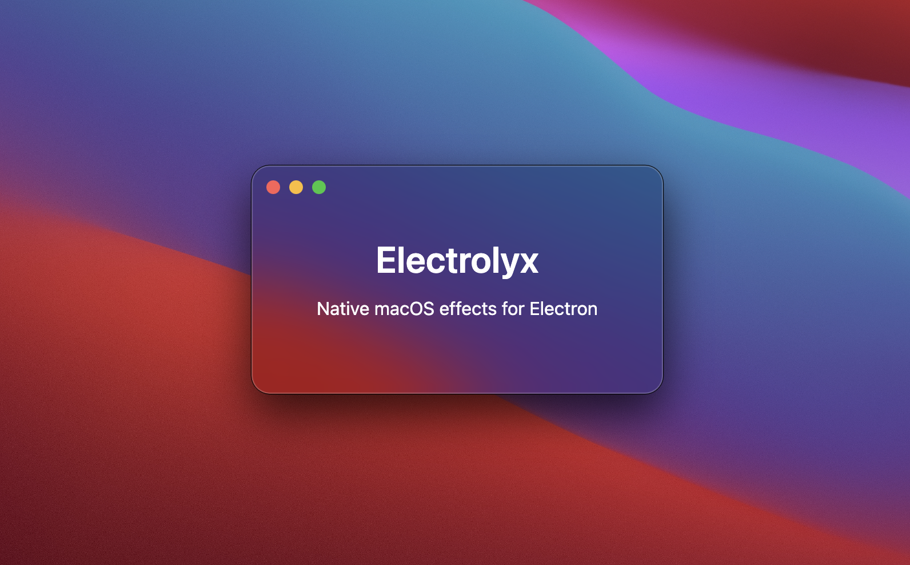

<p align="center">
  
</p>

# Electrolyx

**MIT-licensed Electron toolkit for native macOS visual effects**

Electrolyx brings native macOS window customization and visual effects to Electron applications, including rounded corners and glass/vibrancy effects.

## Features

- **Custom Window Corners**: Apply native-style rounded corners to Electron windows
- **Vibrancy/Glass Effects**: Create translucent UI elements with blur using native `NSVisualEffectView`
- **Window Transparency**: Full control over window background transparency
- **TypeScript Support**: Full type definitions included
- **MIT Licensed**: Completely free for any project

## Installation

```bash
npm install electrolyx
```

### Requirements

- macOS 10.13 (High Sierra) or later
- Electron 20.0.0 or later
- Node.js 16.0.0 or later
- Xcode Command Line Tools (for building native module)

## Quick Start

```typescript
import { app, BrowserWindow } from 'electron';
import { setWindowCornerRadius, addVibrancyView, setWindowTransparent } from 'electrolyx';

function createWindow() {
  const window = new BrowserWindow({
    width: 800,
    height: 600,
    transparent: true,
    titleBarStyle: 'hiddenInset'
  });

  window.once('ready-to-show', () => {
    // Set custom rounded corners
    setWindowCornerRadius(window, 16);

    // Make background transparent
    setWindowTransparent(window);

    // Add sidebar with vibrancy effect
    addVibrancyView(window, {
      x: 0,
      y: 0,
      width: 250,
      material: 'sidebar',
      cornerRadius: 16
    });

    window.show();
  });
}

app.whenReady().then(createWindow);
```

## API Documentation

### `setWindowCornerRadius(window, radius)`

Set custom corner radius for a window.

**Parameters:**
- `window` (BrowserWindow) - Electron BrowserWindow instance
- `radius` (number) - Corner radius in points

**Returns:** `boolean` - true if successful

**Note:** This uses private macOS APIs and may break in future macOS versions.

```typescript
setWindowCornerRadius(mainWindow, 16);
```

---

### `getWindowCornerRadius(window)`

Get the current corner radius of a window.

**Parameters:**
- `window` (BrowserWindow) - Electron BrowserWindow instance

**Returns:** `number` - Current corner radius in points

```typescript
const radius = getWindowCornerRadius(mainWindow);
```

---

### `addVibrancyView(window, options)`

Add a native vibrancy (blur/glass) effect view to a window.

**Parameters:**
- `window` (BrowserWindow) - Electron BrowserWindow instance
- `options` (VibrancyViewOptions) - Configuration options

**VibrancyViewOptions:**

```typescript
interface VibrancyViewOptions {
  x?: number;                    // Default: 0
  y?: number;                    // Default: 0
  width?: number;                // Default: 200
  height?: number;               // Default: window height
  material?: VibrancyMaterial;   // Default: 'sidebar'
  blendingMode?: BlendingMode;   // Default: 'behindWindow'
  state?: VibrancyState;         // Default: 'followsWindowActiveState'
  cornerRadius?: number;         // Default: 0
  autoresizingMask?: {
    width?: boolean;
    height?: boolean;
    minX?: boolean;
    maxX?: boolean;
    minY?: boolean;
    maxY?: boolean;
  };
}
```

**Material Types:**
- `'titlebar'` - Title bar appearance
- `'sidebar'` - Sidebar appearance (default)
- `'menu'` - Menu appearance
- `'popover'` - Popover appearance
- `'hudWindow'` - HUD window appearance
- `'sheet'` - Sheet appearance
- `'tooltip'` - Tooltip appearance
- `'underWindowBackground'` - Under window background

**Example:**

```typescript
addVibrancyView(mainWindow, {
  x: 0,
  y: 0,
  width: 250,
  height: 700,
  material: 'sidebar',
  blendingMode: 'behindWindow',
  cornerRadius: 16,
  autoresizingMask: {
    height: true  // Resize with window height
  }
});
```

---

### `setWindowBackgroundColor(window, color)`

Set the background color of a window.

**Parameters:**
- `window` (BrowserWindow) - Electron BrowserWindow instance
- `color` (RGBColor) - Color object with r, g, b values (0-1)

```typescript
setWindowBackgroundColor(mainWindow, {
  r: 1.0,
  g: 1.0,
  b: 1.0,
  a: 0.95
});
```

---

### `setWindowTransparent(window)`

Make a window background completely transparent.

**Parameters:**
- `window` (BrowserWindow) - Electron BrowserWindow instance

```typescript
setWindowTransparent(mainWindow);
```

## Examples

### Rounded Corners + Transparent Background

```typescript
const window = new BrowserWindow({
  width: 800,
  height: 600,
  transparent: true,
  frame: false
});

window.once('ready-to-show', () => {
  setWindowCornerRadius(window, 20);
  setWindowTransparent(window);
  window.show();
});
```

### Sidebar with Vibrancy

```typescript
addVibrancyView(mainWindow, {
  x: 0,
  y: 0,
  width: 250,
  material: 'sidebar',
  cornerRadius: 16,
  autoresizingMask: {
    height: true  // Auto-resize with window
  }
});
```

### Complete Example

See the `example/` directory for a full working Electron app demonstrating all features.

To run the example:

```bash
npm run build
cd example
npm install
npm start
```

## Important Warnings

### Private APIs

The `setWindowCornerRadius()` function uses **private macOS APIs** that are:
- Not documented by Apple
- Not guaranteed to work across macOS versions
- May change or be removed in future updates
- Could potentially be rejected in Mac App Store submissions

**Use at your own risk** and always test thoroughly on target macOS versions.

### Vibrancy Effects (Safe)

The vibrancy features use **public `NSVisualEffectView` APIs** that are:
- Officially documented by Apple
- Stable across macOS versions
- Safe for Mac App Store submissions

## Comparison with Commercial Alternatives

### Electrolyx (This Library)
- MIT Licensed (Free)
- Basic rounded corner support (private APIs)
- Full vibrancy/blur support (public APIs)
- No commercial licensing required
- Community-supported
- Experimental/best-effort for private API features

### super-browser-window-kit (Commercial)
- Paid per-Bundle-ID licensing
- Robust rounded corner implementation
- Advanced liquid glass effects
- Professional support
- Extensively tested across macOS versions
- Production-ready

**When to use Electrolyx:**
- Personal projects
- Open source projects
- Learning/experimentation
- Budget constraints
- Standard vibrancy effects are sufficient

**When to use commercial alternatives:**
- Production applications
- Mac App Store submissions
- Enterprise applications
- Need guaranteed macOS compatibility
- Require professional support

## Building from Source

```bash
# Install dependencies
npm install

# Build native module and TypeScript
npm run build

# Or build separately
npm run build:native
npm run build:ts
```

## Troubleshooting

### Build Errors with Paths Containing Spaces

If you encounter build errors like `clang: error: no such file or directory` during `npm install`, this is likely due to node-gyp not properly handling paths with spaces (e.g., "Personal Projects", "My Documents").

**Workaround:**

1. Copy the project to a temporary location without spaces:
   ```bash
   cp -R /path/with spaces/electrolyx ~/electrolyx-temp
   cd ~/electrolyx-temp
   rm -rf build node_modules
   npm install
   ```

2. Copy the compiled module back to your original location:
   ```bash
   cp ~/electrolyx-temp/build/Release/electrolyx.node /path/with spaces/electrolyx/build/Release/
   cp -R ~/electrolyx-temp/node_modules /path/with spaces/electrolyx/
   ```

3. Install example dependencies without rebuilding:
   ```bash
   cd /path/with spaces/electrolyx/example
   npm install --ignore-scripts
   ```

**Alternative:** Move your project to a path without spaces for easier development.

## Platform Support

- **macOS**: Full support (10.13+)
- **Windows**: Not supported
- **Linux**: Not supported

The library will gracefully fail on non-macOS platforms.

## TypeScript

Full TypeScript definitions are included. Import types as needed:

```typescript
import { VibrancyViewOptions, VibrancyMaterial, BlendingMode } from 'electrolyx';
```

## Contributing

Contributions are welcome! Please feel free to submit issues and pull requests.

## License

MIT License - see LICENSE file for details

## Disclaimer

This library uses undocumented macOS APIs for certain features. While we strive for compatibility:
- Features may break with macOS updates
- No warranties or guarantees provided
- Use in production at your own risk
- Always test on target macOS versions

For mission-critical applications, consider commercial alternatives with professional support.
